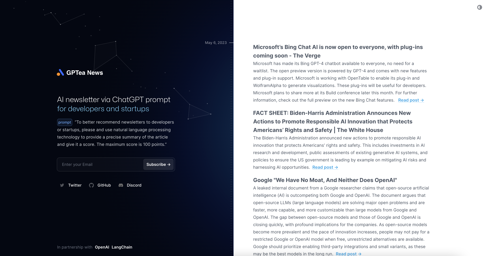
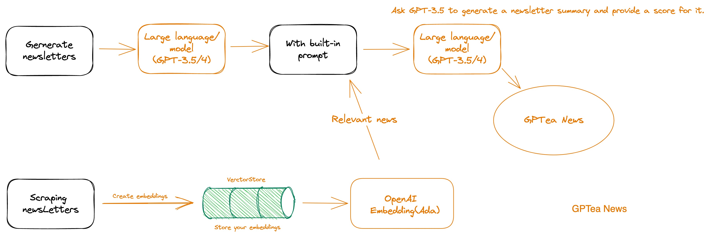

# ChatGPT Newsletter

AI newsletter via ChatGPT prompt for developers and startups.



## Technical Details




Building your own custom ChatGPT involves four steps:

1. Scrape newsletters data.
2. Store embeddings in Postgres with [pgvector](https://supabase.com/docs/guides/database/extensions/pgvector).
3. Perform vector similarity search to find the most relevant content to the question in the scraped newsletters data.
4. Use the found content to generate text completion through OpenAI GPT-3.5/4 API and store results in Postgres database.


## Local Development

### Configuration

- `cp .env.example .env`
- Set your `OPENAI_API_HOST` in the newly created `.env` file.
- Set your `OPENAI_API_KEY` in the newly created `.env` file.
- Set your `DATABASE_URL` in the newly created `.env` file.
- Set your `DIRECT_URL` in the newly created `.env` file.
- Set your `JWT_SECRET_KEY` in the newly created `.env` file.
- Set your `NOVU_API_SECRET` in the newly created `.env` file.


### Start the Next.js App

In a new terminal window, run

```bash
pnpm dev
```

## Deploy

[](https://vercel.com/new/clone?repository-url=https%3A%2F%2Fgithub.com%2Fgptea-ai%2Fgptea-news&env=OPENAI_API_HOST,OPENAI_API_KEY,DATABASE_URL,DIRECT_URL,JWT_SECRET_KEY,NOVU_API_SECRET&envDescription=DIRECT_URL&envLink=https%3A%2F%2Fwww.prisma.io%2Fdocs%2Fdata-platform%2Fdata-proxy%2Fprisma-cli-with-data-proxy%23set-a-direct-database-connection-url-in-your-prisma-schema&project-name=gptea-news&repository-name=gptea-news)

## Credits
  
  - It would not be achievable without OpenAI's ChatGPT.
